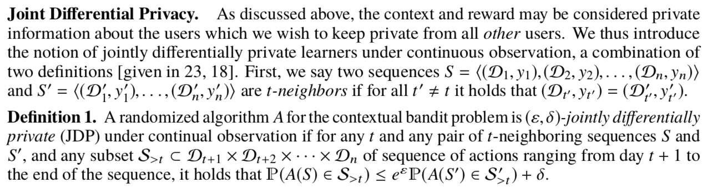

Shariff R, Sheffet O. Differentially Private Contextual Linear Bandits[C]//Advances in Neural Information Processing Systems. 2018: 4296-4306.

#### Abstract

> We first show that using the standard definition of differential privacy results in linear regret. So instead, we adopt the notion of joint differential privacy, where we assume that the action chosen on day t is only revealed to user t and thus needn’t be kept private that day, only on following days.
> We give a general scheme converting the classic linear-UCB algorithm into a joint differentially private algorithm using the tree-based algorithm.
> We then apply either Gaussian noise or Wishart noise to achieve joint-differentially private algorithms and bound the resulting algorithms’ regrets. In addition, we give the first lower bound on the additional regret any private algorithms for the MAB problem must incur.

用标准的DP可以得到线性的regret bound。因此采用了联合DP(joint differential privacy)，假设第t天选择的action只有用户t知道，所以不需要在当天进行保护，只需要保护接下来的日子。

用基于树的算法将linUCB算法转化为符合JDP的算法。加入了高斯噪声或者Wishart噪声。

#### Introduction
> In this work, we give upper and lower bounds for the problem of (joint) differentially private contextual linear bandits.

给出了基于JDP的Contextual MAB问题的上下界。直接用DP会忽略context，并且带来线性的regret，所以本文采用了更relaxed的JDP，
> adopt the more relaxed notion of joint differential privacy [23] which, intuitively, allows us to present the t-th user with products corresponding to her preferences, while guaranteeing that all interactions with all users at times t′ > t have very limited dependence on user t’s preferences.

